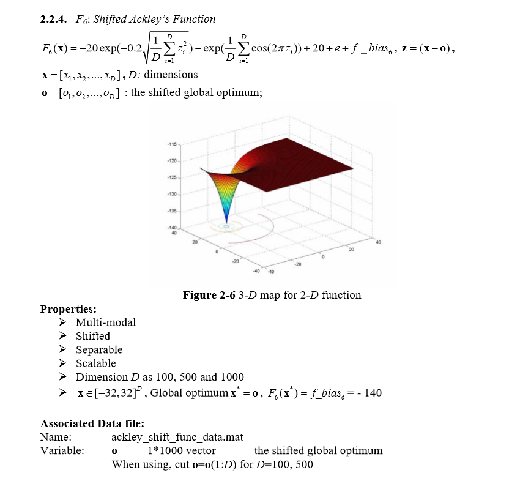
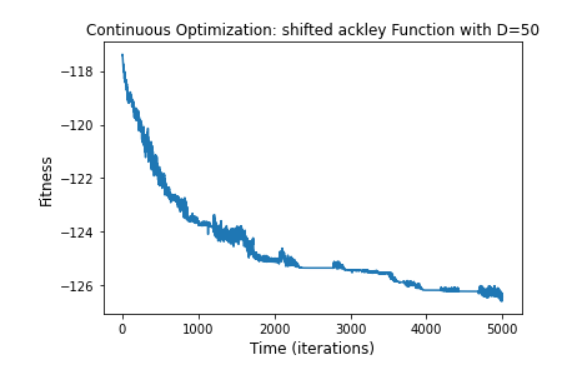
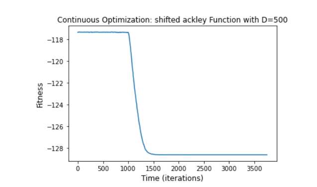

# F1: Shifted Ackley's Function 

Python code for the function can be found [here](ShiftedAckley.ipynb)

#### The chosen algorithm and a justification of this choice:
1. Algorithm - PSO (particle swarm optimization) [for 50 dimensions].
2. Algorithm - Simulated Annealing [for 500 dimensions]
2. Justification - The Ackley function is characterized by a nearly flat outer region, and a large hole at the centre and there are more
chances of getting trapped in local minima so for 50 dimensions i used PSO and for 500 dimensions i used simulated annealing.
PSO is a computational method that optimizes a problem by iteratively trying to improve by placing swarms of particles
and these particles will move around the search space and look for local best and also the entire swarm best position when
position is discovered these particles will be guided and this is a repeated process.
Simulated annealing (SA) is a probabilistic technique for approximating the global optimum of a given function. Specifically, it is a
metaheuristic to approximate global optimization in a large search space.
#### The parameters of the algorithm:
1. f_bias = -140.0
2. inbound, outbound = -32,32
3. pso params for dimension 50 = (gen = 5000,  omega=0.7, eta1=4, eta2=.5)
4. pso params for dimesnion 500 = (Ts=1, Tf=1e-12, n_T_adj=15, n_range_adj=5, bin_size=5, start_range=1)
                                         
#### The final results, both solution and fitness:
1. Champion fitness for 50 dimensions  : [-126.914]
2. All results for the 50 dimensions can be found [here](Fitness%20Result/fitness50.txt)
3. Champion fitness for 500 dimensiosn : [-128.621]
4. All results for the 500 dimensions can be found [here](Fitness%20Result/fitness500.txt)

##### The number of function evaluations: 
1. No of evaluations for 50 dimensions = 250050
2. No of evaluations for 500 dimensions = 250050

##### The stopping criterion - The computational time:
1. Computational time for 50 dimensions = 19.85 seconds
2. Computational time for 500 dimensions = 23.12 seconds

##### The convergence curve (fitness as a function of time:
1. Convergence curve for 50 dimensions:

2. Convergence curve for 500 dimensions:

