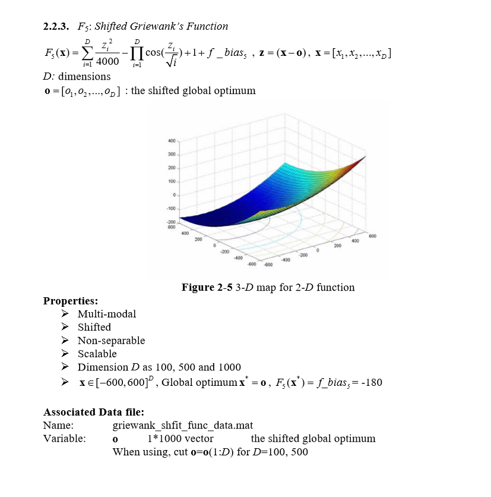

# Shifted Griewank’s Function 

Python code for the function can be found [here](Shifted%20Griewank.ipynb)

#### The chosen algorithm and a justification of this choice:
1. Algorithm - CMAES (covariance matrix adaptation evolution strategy) [for 50 dimensions].
2. Algorithm - PSO (particle swarm optimization) [for 500 dimensions]
2. Justification - The Griewank function has many widespread local minima, which are regularly distributed. 
PSO is a computational method that optimizes a problem by iteratively trying to improve by placing swarms of particles
and these particles will move around the search space and look for local best and also the entire swarm best position when
position is discovered these particles will be guided and this is a repeated process.
The CMA-ES is an evolutionary algorithm for difficult non-linear non-convex black-box optimisation problems in continuous domain,
it is considered as state-of-the-art in evolutionary computation. The CMA-ES is typically applied to unconstrained or bounded constraint
optimization problems, and search space dimensions between three and a hundred. The method is feasible on non-separable and/or badly
conditioned problems, and also for non-smooth and even non-continuous problems.
#### The parameters of the algorithm:
1. f_bias = -180
2. inbound, outbound = -600,600
3. cmaes params for dimension 50 = (gen=300, cc=- 1, cs=- 1, c1=- 1, cmu=- 1, sigma0=-1, ftol=1e-09, xtol=1e-09,
              memory=False, force_bounds=True)
4. pso params for dimesnion 500 = (gen=6000, omega= .7, eta1=4, eta2=.5, max_vel = .1, variant = 6, neighb_type = 2, 
              neighb_param = 5, memory=False)
                                         
#### The final results, both solution and fitness:
1. Champion fitness for 50 dimensions  : [-180]
2. All results for the 50 dimensions can be found [here](Fitness%20Result/fitness50.txt)
3. Champion fitness for 500 dimensiosn : [-177.692]
4. All results for the 500 dimensions can be found [here](Fitness%20Result/fitness500.txt)

##### The number of function evaluations: 
1. No of evaluations for 50 dimensions = 15050
2. No of evaluations for 500 dimensions = 150025

##### The stopping criterion - The computational time:
1. Computational time for 50 dimensions = 1.06 seconds
2. Computational time for 500 dimensions = 37.03 seconds

##### The convergence curve (fitness as a function of time:
1. Convergence curve for 50 dimensions:

2. Convergence curve for 500 dimensions:

