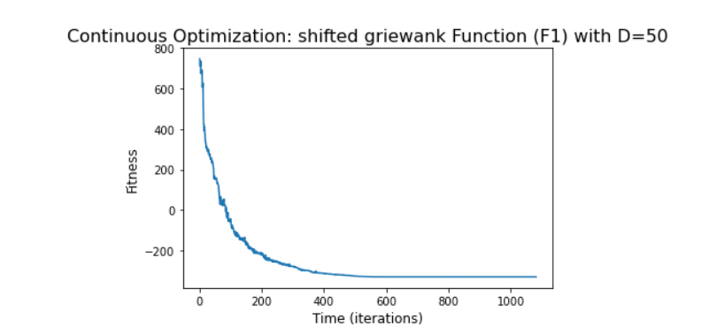

# Shifted Rastrigin’s Function

Python code for the function can be found [here](Shifted%20Rastrigin.ipynb)

#### The chosen algorithm and a justification of this choice:
1. Algorithm - SADE (Self-adaptive Differential Evolution) [for both 50 and 500 dimensions].
2. Justification - The Rastrigin function has several local minima. It is highly multimodal, but locations of the minima are regularly
distributed.Self-adaptive Differential Evolution is a vector-based metaheuristic algorithm, that uses mutation, crossover, and selection to search for
solutions that optimize a given function.

#### The parameters of the algorithm:
1. f_bias = -330
2. inbound, outbound = -5,5
3. sade params for dimension 50  = (gen=2500, variant_adptv=1, ftol=1e-09, xtol=1e-09)
4. sade params for dimesnion 500 = (gen=2500, variant_adptv=1, ftol=1e-09, xtol=1e-09)
                                         
#### The final results, both solution and fitness:
1. Champion fitness for 50 dimensions  : [-330]
2. All results for the 50 dimensions can be found [here](Fitness%20Result/fitness50.txt)
3. Champion fitness for 500 dimensiosn : [-330]
4. All results for the 500 dimensions can be found [here](Fitness%20Result/fitness500.txt)

##### The number of function evaluations: 
1. No of evaluations for 50 dimensions = 54125
2. No of evaluations for 500 dimensions = 1080500

##### The stopping criterion - The computational time:
1. Computational time for 50 dimensions = 2.82 seconds
2. Computational time for 500 dimensions = 112.0 seconds

##### The convergence curve (fitness as a function of time:
1. Convergence curve for 50 dimensions:

2. Convergence curve for 500 dimensions:

