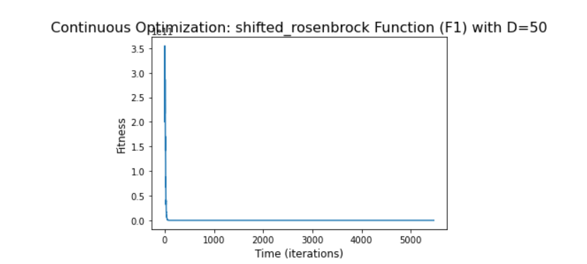

# Shifted Rosenbrock’s Function 

Python code for the function can be found [here](Shifted%20Rosenbrock.ipynb)

#### The chosen algorithm and a justification of this choice:
1. Algorithm - CMAES (Covariance Matrix Adaptation Evolution Strategy) [for 50 dimensions].
2. Algorithm - SADE (Self-adaptive Differential Evolution) [for 500 dimensions]
2. Justification - The function is unimodal, and the global minimum lies in a narrow, parabolic valley. However, even though this valley
is easy to find, convergence to the minimum is difficult.
The CMA-ES is typically applied to unconstrained or bounded constraint optimization problems, and search space dimensions between three
and a hundred. The method is feasible on non-separable and/or badly conditioned problems, and also for non-smooth and even non-continuous
problems.
Self-adaptive Differential evolution is a vector-based metaheuristic algorithm, that uses mutation, crossover, and selection to search for solutions that
optimize a given function.
#### The parameters of the algorithm:
1. f_bias = 390
2. inbound, outbound = -100,100
3. CMAES params for dimension 50 = (gen=3000, cc=-1, cs=-1, c1=-1, cmu=-1, sigma0=.5, ftol=1e-06, xtol=1e-09, memory=False, force_bounds=True)
4. SADE params for dimesnion 500 = (gen=30000, variant_adptv=1, ftol=1e-1, xtol=1e-1)
                                         
#### The final results, both solution and fitness:
1. Champion fitness for 50 dimensions  : [390]
2. All results for the 50 dimensions can be found [here](Fitness%20Result/fitness50.txt)
3. Champion fitness for 500 dimensiosn : [924.909]
4. All results for the 500 dimensions can be found [here](Fitness%20Result/fitness500.txt)

##### The number of function evaluations: 
1. No of evaluations for 50 dimensions = 273500
2. No of evaluations for 500 dimensions = 750025

##### The stopping criterion - The computational time:
1. Computational time for 50 dimensions = 119.01 seconds
2. Computational time for 500 dimensions = 1869.76 seconds

##### The convergence curve (fitness as a function of time:
1. Convergence curve for 50 dimensions:

2. Convergence curve for 500 dimensions:

