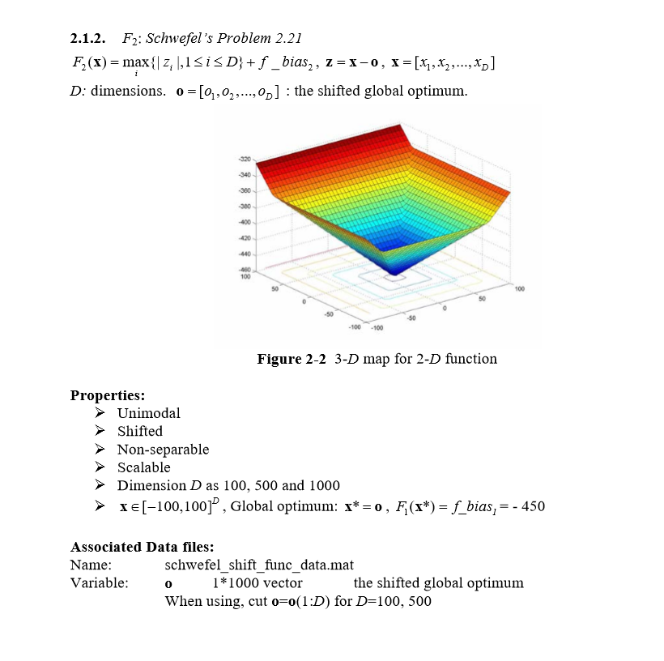
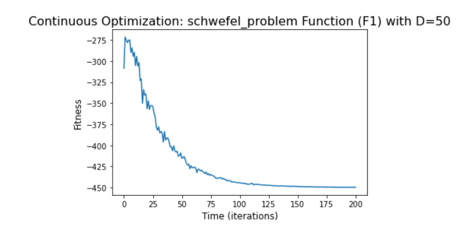
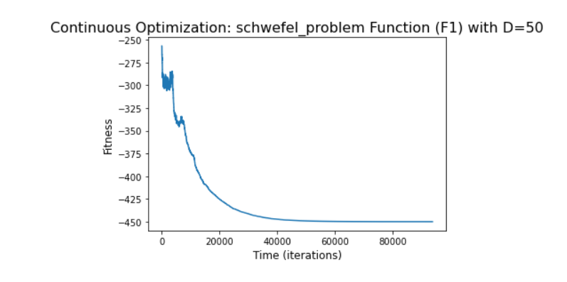

# F2: Schwefel’s Problem 

Python code for the function can be found [here](Shifted%20Schwefel.ipynb)

#### The chosen algorithm and a justification of this choice:
1. Algorithm - CMAES (Covariance Matrix Adaptation Evolution Strategy) [for 50 dimensions].
2. Algorithm - SA (Simulated Annealing) [for 500 dimensions]
2. Justification - The Schwefel function is complex, with many local minima.
The CMA-ES is typically applied to unconstrained or bounded constraint optimization problems, and search space dimensions between three
and a hundred. The method is feasible on non-separable and/or badly conditioned problems, and also for non-smooth and even non-continuous
problems.
Simulated annealing (SA) is a probabilistic technique for approximating the global optimum of a given function. Specifically, it is a
metaheuristic to approximate global optimization in a large search space for an optimization problem.
#### The parameters of the algorithm:
1. f_bias = -450
2. inbound, outbound = -100,100
3. CMAES params for dimension 50 = (gen=200, cc=- 1, cs=- 1, c1=- 1, cmu=- 1, sigma0=-1, ftol=1e-09,xtol=1e-09, memory=False, force_bounds=True)
4. SA params for dimesnion 500 = (Ts=1, Tf=1e-12, n_T_adj=25, n_range_adj=25, bin_size=15, start_range=.5)
                                         
#### The final results, both solution and fitness:
1. Champion fitness for 50 dimensions  : [-449.772]
2. All results for the 50 dimensions can be found [here](Fitness%20Result/fitness50.txt)
3. Champion fitness for 500 dimensiosn : [-449.994]
4. All results for the 500 dimensions can be found [here](Fitness%20Result/fitness500.txt)

##### The number of function evaluations: 
1. No of evaluations for 50 dimensions = 10050
2. No of evaluations for 500 dimensions = 4687501

##### The stopping criterion - The computational time:
1. Computational time for 50 dimensions = 1.64 seconds
2. Computational time for 500 dimensions = 405.88 seconds

##### The convergence curve (fitness as a function of time:
1. Convergence curve for 50 dimensions:

2. Convergence curve for 500 dimensions:

