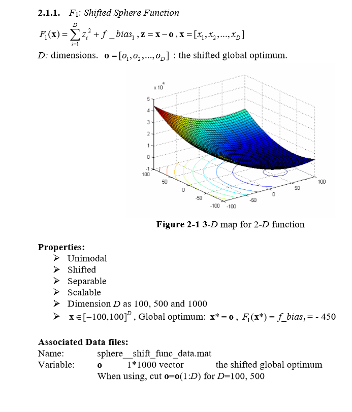
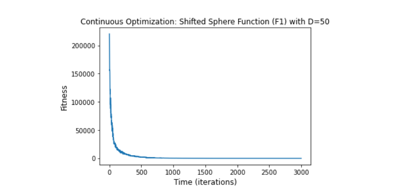
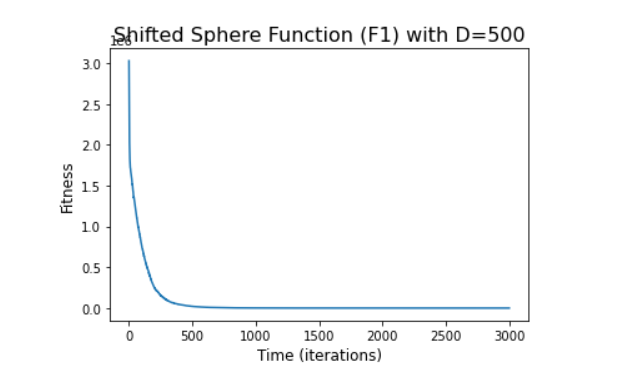

# F1: Shifted Sphere Function 

#### The chosen algorithm and a justification of this choice:
1. Algorithm - PSO (particle swarm optimization) [for both 50 and 500 dimensions].
2. Justification - The Sphere function has d local minima except for the global one. It is continuous, convex and unimodal.
PSO is a computational method that optimizes a problem by iteratively trying to improve by placing swarms of particles
and these particles will move around the search space and look for local best and also the entire swarm best position when
position is discovered these particles will be guided and this is a repeated process.
Because my sphere function has only one global minima i am using pso to search around to find the best position.

#### The parameters of the algorithm:
1. f_bias = -450
2. inbound, outbound = -100,100
3. pso params for dimension 50 = (gen = 3000,  omega=0.72, eta1=2.1, eta2=2.8)
4. pso params for dimesnion 500 = (gen=3000, omega= .7, eta1=0.5, eta2=4, max_vel = .05, variant = 6, neighb_type = 2, 
                                         neighb_param = 4, memory=False)
                                         
#### The final results, both solution and fitness:
1. Champion fitness for 50 dimensions  : [-448.921]
2. All results for the 50 dimensions can be found here [Fitness Results](Fitness%20Result/fitness50.txt)
3. Champion fitness for 500 dimensiosn : [-449.642]
4. All results for the 500 dimensions can be found here [Fitness Results](Fitness%20Result/fitness500.txt)

##### The number of function evaluations: 
1. No of evaluations for 50 dimensions = 150050
2. No of evaluations for 500 dimensions = 150050

##### The stopping criterion - The computational time:
1. Computational time for 50 dimensions = 2.97 seconds
2. Computational time for 500 dimensions = 15.11 seconds

##### The convergence curve (fitness as a function of time:
1. Convergence curve for 50 dimensions:

2. Convergence curve for 500 dimensions:

